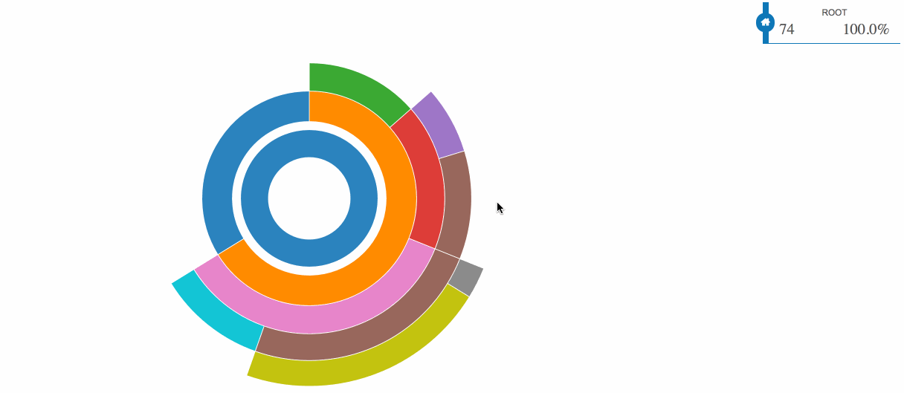

> [d2b](../README.md) › **Chart Sunburst**



# {#generator}
[#](#generator) d2b.**chartSunburst**()

Constructs a new sunburst chart generator with the default settings.

When using the d2b-sunburst generator you can draw a sunburst chart onto each element in the selection.

# {#apply}
[#](#apply) *sunburst*(*context*)

Render the sunburst chart(s) to the given *context*, which may be either a [d3-selection](https://github.com/d3/d3-selection) of html containers (e.g. div) or a corresponding [d3-transition](https://github.com/d3/d3-transition).

Before applying the d2b-sunburst-chart generator, you should join the data to the selected element(s) using [selection.data](https://github.com/d3/d3-selection#selection_data) or [selection.datum](https://github.com/d3/d3-selection#selection_datum). Here is the default data format.

```javascript
var sunburst = d2b.chartSunburst();

sunburst.chartFrame().size({height: 500});

var chart = d3.select('.sunburst-chart');

chart
    .datum({
      label: 'root',
      children: [
        {
          label: 'child 1',
          children: [
            {
              label: 'child 1-1',
              size: 10
            },
            {
              label: 'child 1-2',
              children: [
                {
                  label: 'child 1-2-1',
                  size: 5
                },
                {
                  label: 'child 1-3-1',
                  size: 8
                }
              ]
            },
            {
              label: 'child 1-3',
              selected: true,
              children: [
                {
                  label: 'child 1-3-1',
                  children: [
                    {
                      label: 'child 1-3-1-1',
                      size: 2
                    },
                    {
                      label: 'child 1-3-1-2',
                      size: 16
                    }
                  ]
                },
                {
                  label: 'child 1-3-2',
                  size: 8
                }
              ]
            }
          ]
        },
        {
          label: 'child 2',
          size: 25
        }
      ]
    })
  .transition()
    .call(sunburst);
```

# {#chart_frame}
[#](#chart_frame) sunburst.**chartFrame**([*chartFrame*])

If *chartFrame* is specified, sets the *chartFrame* generator to the specified [d2b.chartFrame](../utils/chart_frame.md) and returns the sunburst-chart generator. If *chartFrame* is not specified, returns the current *chartFrame* generator, which defaults to `d2b.chartFrame().legendEnabled(false).breadcrumbsEnabled(true)`.

The *chartFrame* can be configured at will.

# {#breadcrumbs}
[#](#breadcrumbs) sunburst.**breadcrumbs**([*breadcrumbs*])

If *breadcrumbs* is specified, sets the *breadcrumbs* generator to the specified [d2b.breadcrumbs](../utils/breadcrumbs.md) and returns the sunburst-chart generator. If *breadcrumbs* is not specified, returns the current *breadcrumbs* generator, which defaults to:

```javascript
const tipTemplate = function (d) {
  const percent = d.value / d.selected.value;
  const percentText = percent > 1 ?
    '' :
    `<div class = 'd2b-sunburst-percent'>
      ${formatPercent(d.value / d.selected.value)}
    </div>`;

  return `
    <div class = 'd2b-sunburst-label'>
      ${d.label}
    </div>
    <div class = 'd2b-sunburst-value'>
      ${format(d.value)}
      ${percentText}
    </div>
  `;
};

d2b.breadcrumbs()
  .html(d => `<div class = 'd2b-sunburst-breadcrumb'>${tipTemplate(d)}</div>`);
```

The *breadcrumbs* can be configured at will, except for the [color](../utils/breadcrumbs.md#color) and [key](../utils/breadcrumbs.md#key) properties which will be set automatically by the sunburst-chart.

# {#tooltip}
[#](#tooltip) sunburst.**tooltip**([*tooltip*])

If *tooltip* is specified, sets the *tooltip* generator to the specified [d2b.tooltip](../utils/tooltip.md) and returns the sunburst-chart generator. If *tooltip* is not specified, returns the current *tooltip* generator, which defaults to:

```javascript
const tipTemplate = function (d) {
  const percent = d.value / d.selected.value;
  const percentText = percent > 1 ?
    '' :
    `<div class = 'd2b-sunburst-percent'>
      ${formatPercent(d.value / d.selected.value)}
    </div>`;

  return `
    <div class = 'd2b-sunburst-label'>
      ${d.label}
    </div>
    <div class = 'd2b-sunburst-value'>
      ${format(d.value)}
      ${percentText}
    </div>
  `;
};

d2b.tooltip()
  .followMouse(true)
  .html(d => `<div class = 'd2b-sunburst-tooltip'>${tipTemplate(d)}</div>`);
```

The *tooltip* can be configured at will, except for the [color](../utils/tooltip.md#color) property which will be set automatically by the sunburst-chart.

# {#sunburst}
[#](#sunburst) sunburst.**sunburst**([*sunburst*])

If *sunburst* is specified, sets the *sunburst* generator to the specified [d2b.sunburst](../svg/sunburst.md) and returns the sunburst-chart generator. If *sunburst* is not specified, returns the current *sunburst* generator, which defaults to `d2b.svgSunburst()`.

The *sunburst* can be configured at will, except for the [color](../svg/sunburst.md#color) property which will be set automatically by the sunburst-chart.

### Datum Level Accessors

When the d2b sunburst-chart generator is applied to a selection, the following properties will be invoked. The function will be passed the element's bound [datum](https://github.com/d3/d3-selection#selection_datum) `d`.

# {#outer_radius}
[#](#outer_radius) sunburst.**outerRadius**([*outerRadius*])

If *outerRadius* is specified, sets the sunburst-chart radius to the specified accessor function or value in pixels and returns the sunburst-chart generator. If *outerRadius* is not specified, returns the current *outerRadius* accessor, which defaults to:

```javascript
function (d, w, h) {
  return Math.min(w, h) / 2;
}
```

In addition to the element datum `d`, the *outerRadius* accessor function is also provided with the chart width `w` and height `h`.

# {#inner_radius}
[#](#inner_radius) sunburst.**innerRadius**([*innerRadius*])

If *innerRadius* is specified, sets the sunburst-chart radius to the specified accessor function or value in pixels and returns the sunburst-chart generator. If *innerRadius* is not specified, returns the current *innerRadius* accessor, which defaults to:

```javascript
function (d, w, h) {
  return Math.min(50, Math.min(w, h) / 4);
}
```

In addition to the element datum `d`, the *innerRadius* accessor function is also provided with the chart width `w` and height `h`.

### Value Level Accessors

When the d2b sunburst-chart generator is applied to a selection, the following properties will be invoked for each node in the hierarchy. The function will be passed the value data `d` as defined by the [svg-sunburst](#sunburst).

# {#color}
[#](#color) sunburst.**color**([*color*])

If *color* is specified, sets the *color* accessor to the specified accessor function and returns the sunburst generator. If *color* is not specified, returns the current *color* accessor, which defaults to:

```javascript
// define d3 color scale that will be used in the accessor
var color = d3.scaleOrdinal(d3.schemeCategory10);

function (d) {
  return color(d.label);
}
```
